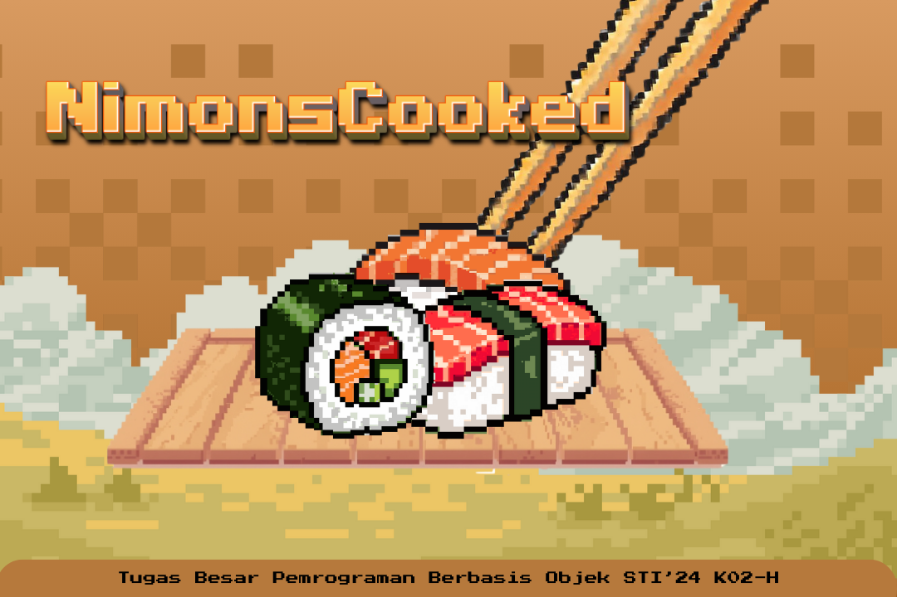

# 🍣 NimonsCooked 
_Final Project – Object-Oriented Programming STI’24 K02-H_




---

## 🎮 Game Description
**NimonsCooked** is a pixel-art, time-management cooking game inspired by *Overcooked*.  
Players control **two chefs** who must collaborate to prepare sushi dishes, manage kitchen stations, and complete customer orders under time pressure.

This project demonstrates the application of **Object-Oriented Programming (OOP)** principles, such as abstraction, inheritance, polymorphism, and encapsulation.

## 🧩 Main Features
- Two difficulty levels: **Easy** and **Hard**
- Dual-chef system with instant character switching
- Interactive kitchen stations (ingredients, cutting board, stove, serving area, etc.)
- Sushi recipe and processing system
- Time-based scoring and stage evaluation


## 🕹️ Controls

### Main Menu
| Key | Action |
|-----|--------|
| **X** | Start → Stage Select |
| **H** | Help |
| **Q** | Exit Game |

### Help Menu
| Key | Action |
|-----|--------|
| **ESC** | Back to Main Menu |

### Stage Select
| Key | Action |
|-----|--------|
| **1** | Start Easy Stage |
| **2** | Start Hard Stage |
| **ESC** | Back to Main Menu |

### In Game
| Key | Action |
|-----|--------|
| **W / A / S / D** | Move Chef |
| **E** | Interact (pick up, cut, cook, deliver) |
| **B** | Switch Chef |

### Post Stage
| Key | Action |
|-----|--------|
| **R** | Retry Stage |
| **N** | Back to Stage Select |


```md
## ▶️ How to Run the Game


---


## ▶️ How to Run the Game
To run NimonsCooked, simply navigate to the main entry file located at `src/Game/Main.java`. You can run the game directly from your IDE (VS Code, IntelliJ, Eclipse) by opening this file and selecting Run, or you can run it from the terminal by compiling all Java files and then executing the main class. If using the terminal, run the following commands:
$files = Get-ChildItem -Recurse -Filter *.java | Select-Object -ExpandProperty FullName
javac -d out $files
java -cp out src.Game.MainGame
As long as you run `Main.java`, the game will start normally.